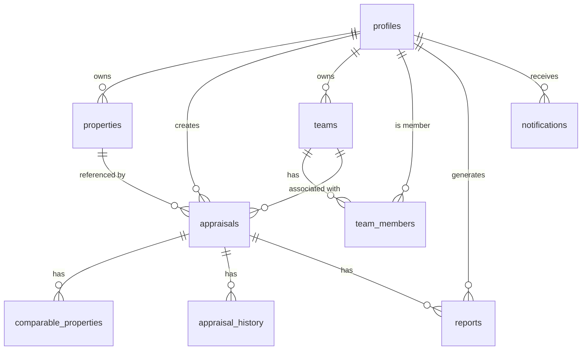

# AppraisalHub Database Schema Documentation

This document outlines the complete database schema for the AppraisalHub application, including tables, relationships, indexes, and Row Level Security (RLS) policies.

## Table Overview

## Tables and Fields

### profiles
Stores user information extending auth.users

| Column | Type | Description |
|--------|------|-------------|
| id | UUID | Primary key, references auth.users |
| created_at | TIMESTAMPTZ | Creation timestamp |
| updated_at | TIMESTAMPTZ | Last update timestamp |
| email | TEXT | User email (unique) |
| full_name | TEXT | User's full name |
| avatar_url | TEXT | URL to user's profile image |
| role | TEXT | User role (agent, customer, admin) |
| phone | TEXT | User's phone number |
| organization | TEXT | User's organization |
| settings | JSONB | User settings |

### teams
For organizing agents into teams/agencies

| Column | Type | Description |
|--------|------|-------------|
| id | UUID | Primary key |
| created_at | TIMESTAMPTZ | Creation timestamp |
| updated_at | TIMESTAMPTZ | Last update timestamp |
| name | TEXT | Team name |
| description | TEXT | Team description |
| logo_url | TEXT | URL to team logo |
| owner_id | UUID | Team owner (references profiles.id) |
| settings | JSONB | Team settings |

### team_members
Links users to teams with specific roles

| Column | Type | Description |
|--------|------|-------------|
| id | UUID | Primary key |
| created_at | TIMESTAMPTZ | Creation timestamp |
| updated_at | TIMESTAMPTZ | Last update timestamp |
| team_id | UUID | Team ID (references teams.id) |
| user_id | UUID | User ID (references profiles.id) |
| role | TEXT | Member role (member, admin) |

### properties
Stores property information

| Column | Type | Description |
|--------|------|-------------|
| id | UUID | Primary key |
| created_at | TIMESTAMPTZ | Creation timestamp |
| updated_at | TIMESTAMPTZ | Last update timestamp |
| owner_id | UUID | Property owner (references profiles.id) |
| address | TEXT | Property address |
| suburb | TEXT | Property suburb |
| city | TEXT | Property city |
| postcode | TEXT | Property postcode |
| property_type | TEXT | Type of property |
| bedrooms | INTEGER | Number of bedrooms |
| bathrooms | NUMERIC(3,1) | Number of bathrooms |
| land_size | NUMERIC(10,2) | Land size in square meters |
| floor_area | NUMERIC(10,2) | Floor area in square meters |
| year_built | INTEGER | Year property was built |
| features | TEXT[] | Array of property features |
| images | TEXT[] | Array of image URLs |
| is_public | BOOLEAN | Whether property is publicly visible |
| status | TEXT | Property status (active, archived, draft) |
| metadata | JSONB | Additional property metadata |

### appraisals
Stores property appraisal information

| Column | Type | Description |
|--------|------|-------------|
| id | UUID | Primary key |
| created_at | TIMESTAMPTZ | Creation timestamp |
| updated_at | TIMESTAMPTZ | Last update timestamp |
| user_id | UUID | User who created the appraisal |
| property_id | UUID | Associated property (references properties.id) |
| property_address | TEXT | Property address |
| property_suburb | TEXT | Property suburb |
| property_city | TEXT | Property city |
| property_type | TEXT | Type of property |
| bedrooms | INTEGER | Number of bedrooms |
| bathrooms | NUMERIC(3,1) | Number of bathrooms |
| land_size | NUMERIC(10,2) | Land size in square meters |
| floor_area | NUMERIC(10,2) | Floor area in square meters |
| year_built | INTEGER | Year property was built |
| valuation_low | NUMERIC(12,2) | Low-end valuation |
| valuation_high | NUMERIC(12,2) | High-end valuation |
| valuation_confidence | INTEGER | Confidence level (0-100) |
| status | TEXT | Appraisal status |
| report_url | TEXT | URL to generated report |
| team_id | UUID | Associated team |
| metadata | JSONB | Additional appraisal metadata |
| ai_content | JSONB | AI-generated content |

### comparable_properties
Stores properties used for comparison in appraisals

| Column | Type | Description |
|--------|------|-------------|
| id | UUID | Primary key |
| created_at | TIMESTAMPTZ | Creation timestamp |
| updated_at | TIMESTAMPTZ | Last update timestamp |
| appraisal_id | UUID | Associated appraisal (references appraisals.id) |
| address | TEXT | Property address |
| suburb | TEXT | Property suburb |
| city | TEXT | Property city |
| property_type | TEXT | Type of property |
| bedrooms | INTEGER | Number of bedrooms |
| bathrooms | NUMERIC(3,1) | Number of bathrooms |
| land_size | NUMERIC(10,2) | Land size in square meters |
| floor_area | NUMERIC(10,2) | Floor area in square meters |
| year_built | INTEGER | Year property was built |
| sale_date | DATE | Date of sale |
| sale_price | NUMERIC(12,2) | Sale price |
| similarity_score | INTEGER | Similarity to the appraised property (0-100) |
| adjustment_factor | NUMERIC(5,2) | Price adjustment factor |
| adjusted_price | NUMERIC(12,2) | Adjusted price |
| notes | TEXT | Notes about the comparable |
| image_url | TEXT | URL to property image |
| metadata | JSONB | Additional metadata |

### appraisal_history
Tracks changes to appraisals

| Column | Type | Description |
|--------|------|-------------|
| id | UUID | Primary key |
| created_at | TIMESTAMPTZ | Creation timestamp |
| appraisal_id | UUID | Associated appraisal (references appraisals.id) |
| user_id | UUID | User who made the change |
| action | TEXT | Action performed |
| changes | JSONB | Details of changes made |

### reports
Tracks generated PDF reports

| Column | Type | Description |
|--------|------|-------------|
| id | UUID | Primary key |
| created_at | TIMESTAMPTZ | Creation timestamp |
| updated_at | TIMESTAMPTZ | Last update timestamp |
| appraisal_id | UUID | Associated appraisal (references appraisals.id) |
| user_id | UUID | User who generated the report |
| file_path | TEXT | Path to the report file |
| file_size | INTEGER | File size in bytes |
| version | INTEGER | Report version |
| is_current | BOOLEAN | Whether this is the current version |
| status | TEXT | Report status |
| error_message | TEXT | Error message if generation failed |
| metadata | JSONB | Additional metadata |

### notifications
Stores user notifications

| Column | Type | Description |
|--------|------|-------------|
| id | UUID | Primary key |
| created_at | TIMESTAMPTZ | Creation timestamp |
| user_id | UUID | User who receives the notification |
| type | TEXT | Notification type |
| title | TEXT | Notification title |
| message | TEXT | Notification message |
| metadata | JSONB | Additional metadata |
| read | BOOLEAN | Whether notification has been read |
| read_at | TIMESTAMPTZ | When notification was read |

## Row Level Security (RLS) Policies

### profiles
- Users can read their own profile
- Admins can read all profiles
- Users can update their own profile
- Admins can update any profile

### teams
- Team owners and members can read their teams
- Team owners can create, update, and delete their teams
- Admins can read all teams

### team_members
- Team owners and members can read team membership
- Team owners can create, update, and delete team members
- Admins can read all team memberships

### properties
- Users can read their own properties
- Users can read public properties
- Users can create, update, and delete their own properties
- Admins can read all properties

### appraisals
- Users can read their own appraisals
- Team members can read team appraisals
- Users can create, update, and delete their own appraisals
- Team members can update team appraisals
- Admins can read all appraisals

### comparable_properties
- Appraisal owners can read and manage comparable properties
- Team members can read comparable properties for team appraisals
- Admins can read all comparable properties

### appraisal_history
- Appraisal owners can read history
- Team members can read history for team appraisals
- History entries are automatically created
- Admins can read all history

### reports
- Appraisal owners can read their reports
- Team members can read reports for team appraisals
- Admins can read all reports

### notifications
- Users can read their own notifications
- Users can mark their notifications as read
- Admins can manage all notifications

## Indexes

The schema includes optimized indexes for common query patterns:
- Text search indexes for property addresses
- Indexes on foreign keys for efficient joins
- Indexes on status fields for filtering

## Testing

Database RLS policies are tested using pgTAP, ensuring that:
- Users can only access their own data
- Team collaborations work correctly
- Admins have appropriate access levels 